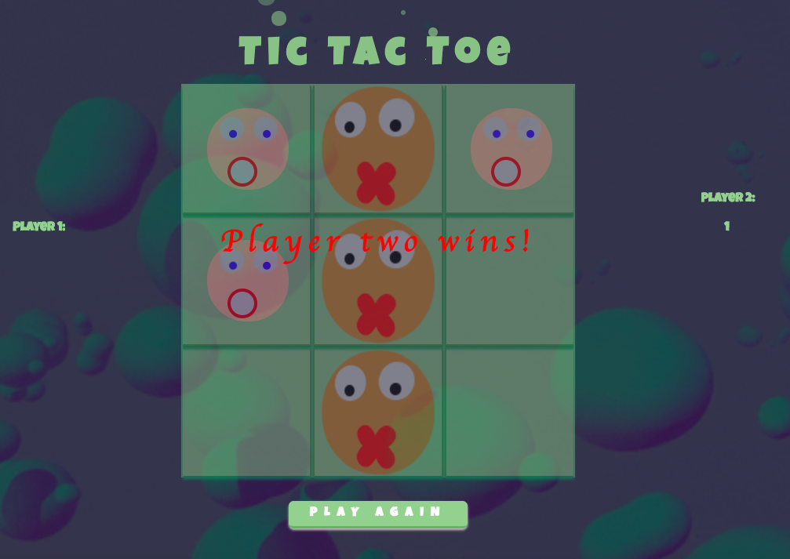
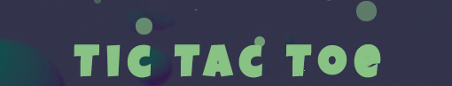

# Project0 Tic Tac Toe - 3 day deadline project

Play the classic Tic Tac Toe game! And do not forget to put the volume up!

```diff
text in green `This game is FULL of css effects`
```

[Click here to access the game!]( https://pkijowska.github.io/tictactoe/)


## Features

Each part of the game will have a different effects:
1. If the player 2 wins the bubbles will start turning around.

1. In case of the draw - all the bubbles will start bounce.

There are bubbles coming out of the tic tac toe text (made in javascript)


## Bugs
None I am aware of.

## TODO List
1. An unbeatable AI
1. Make the bubble faces look nicer
1. Make a module that will enable players to pick the the bubble they want to be


## Technologies
- Made with jquery, javascript, css
- Used animate css
- Used sounds effects


## Thank you

1. Rashida & Joel for helping me several times when I got stuck
1. Lucy for making the eyes work   (◔_◔)
