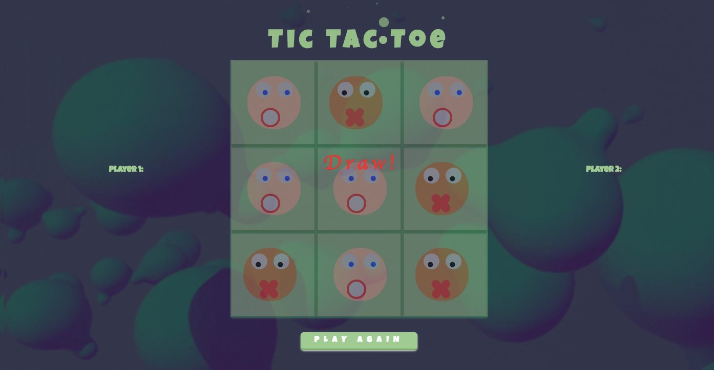

# Project0 Tic Tac Toe - Made in less than 4 days!

Play the classic Tic Tac Toe game! And do not forget to put the volume up!

```diff
This game is full of Css effects!
```

[Click here to access the game!]( https://pkijowska.github.io/tictactoe/)




## Features

Each part of the game will have a different effects:
1. If the player 2 wins the bubbles will start turning around.

1. In case of the draw - all the bubbles will start bounce.

There are bubbles coming out of the tic tac toe text (made in javascript)


## Bugs
Not fully mobile friendly :( Definitely need to change that.

## TODO List
1. An unbeatable AI
1. Make the bubble faces look nicer
1. Make a module that will enable players to pick the the bubble they want to be


## Technologies
- Made with jquery, javascript, css
- Used animate css
- Used sounds effects (different sound effects depending on who wins)


## Thank you

1. Rashida & Joel for helping me several times when I got stuck
1. Taryn Ewens. After her presentation at GA I got inspired to use moving eyes. 
1. Lucy for making the eyes work   (◔_◔)
